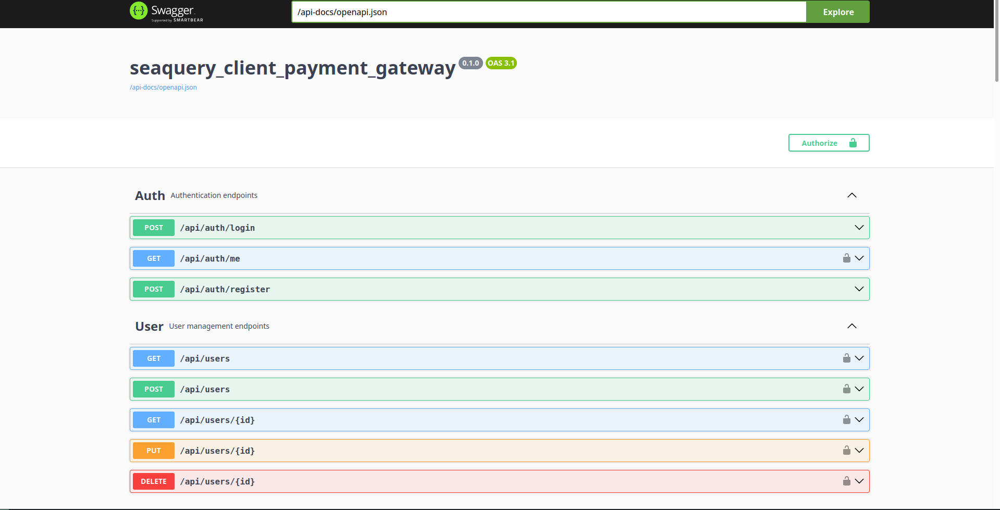
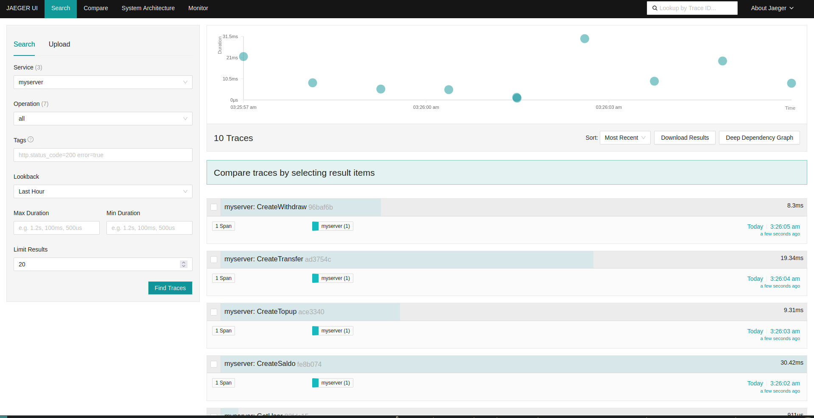
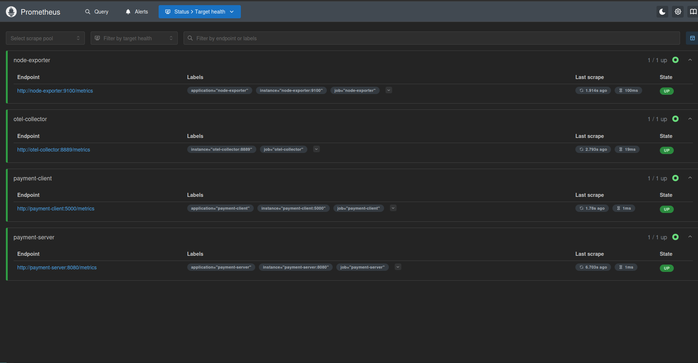
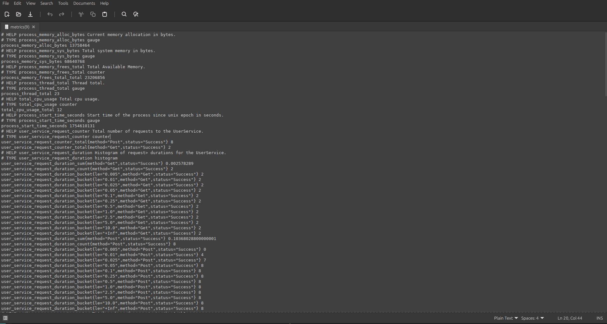
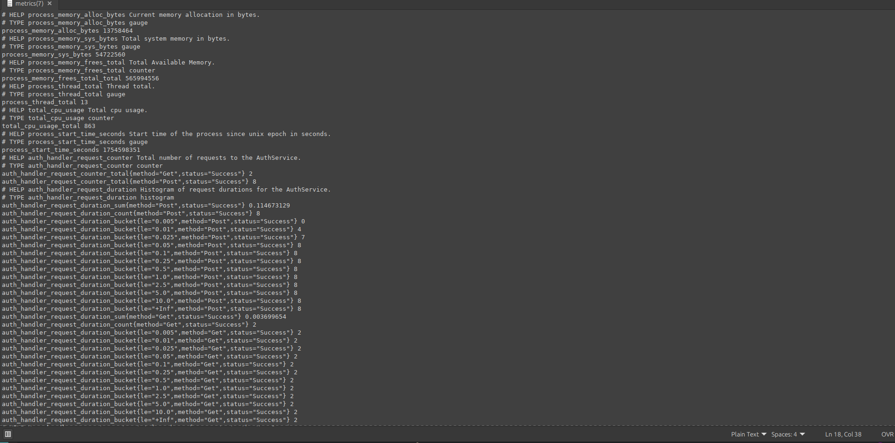

# 🚀 Payment Gateway with Axum, SeaQuery & Tonic (Rust)

A modern, high-performance **payment gateway service** built in **Rust** using:
- **Axum** for REST API
- **Tonic** for gRPC services
- **SeaQuery + SQLx** for type-safe database queries
- **PostgreSQL & Redis** as data stores
- Full **observability stack**: OpenTelemetry, Prometheus, Grafana, Loki, Jaeger, Alertmanager


---

## 🧩 Teknologi & Arsitektur

<div className="tech-grid">

| Komponen | Teknologi |
|--------|----------|
| Backend | Rust (async) |
| Web Framework | [Axum](https://github.com/tokio-rs/axum) |
| gRPC Server | [Tonic](https://github.com/hyperium/tonic) |
| ORM/Query Builder | [SeaQuery + SQLx](https://www.sea-ql.org/) |
| Database | PostgreSQL 17 |
| Cache | Redis 7 |
| Auth | JWT + bcrypt |
| Logging | `tracing` + `tracing-subscriber` |
| Validation | `validator` |
| UUID | `uuid` v4 |
| Observability | OpenTelemetry, Prometheus, Grafana, Loki, Jaeger, Node Exporter |
| CI/CD | GitHub Container Registry (GHCR) |


## 📦 Struktur Proyek

```bash
.
├── crates/
│   ├── client/             # gRPC client (Axum frontend)
│   ├── server/             # gRPC server (core logic)
│   ├── genproto/           # Generated gRPC/Protobuf code
│   └── shared/             # Shared models, errors, utils
├── docker-compose.yml      # Full stack orchestration
├── otel-collector.yaml     # OpenTelemetry collector config
├── prometheus.yml          # Prometheus scraping config
├── observability/
│   ├── loki-config.yaml
│   ├── promtail-config.yaml
│   └── alertmanager.yml
├── logs/                   # Runtime logs (mounted volume)
└── README.md
```

## Endpoint & Layanan


| Layanan                   | Port   | URL / Keterangan                                                                 |
|---------------------------|--------|----------------------------------------------------------------------------------|
| **REST API (Client)**     | `5000` | [http://localhost:5000](http://localhost:5000)                                   |
| **gRPC Server**           | `50051`| `localhost:50051`                                                                |
| **Grafana**               | `3000` | [http://localhost:3000](http://localhost:3000) (login: `admin` / `admin`)        |
| **Prometheus**            | `9090` | [http://localhost:9090](http://localhost:9090)                                   |
| **Jaeger**                | `16686`| [http://localhost:16686](http://localhost:16686)                                 |
| **Loki**                  | `3100` | [http://localhost:3100](http://localhost:3100)                                   |
| **OpenTelemetry Collector** | `4317` | gRPC OTLP endpoint                                                              |
| **Alertmanager**          | `9093` | [http://localhost:9093](http://localhost:9093)                                   |
##

## Screenshoot

### OpenApi



### Jaeger




### Prometheus




### Metrics

#### Metrics Server



#### Metrics Client


